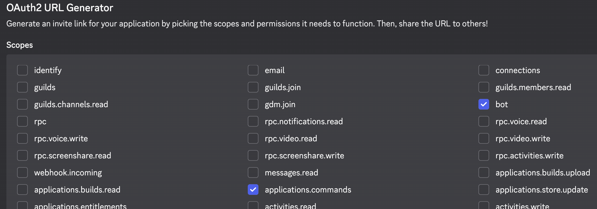
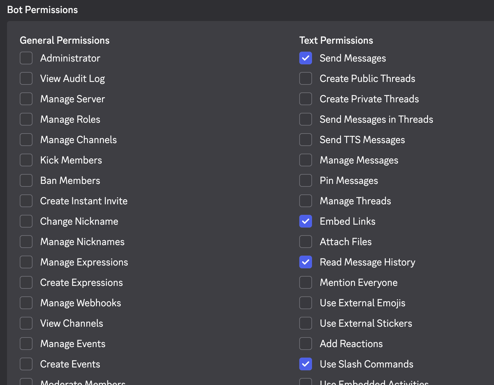
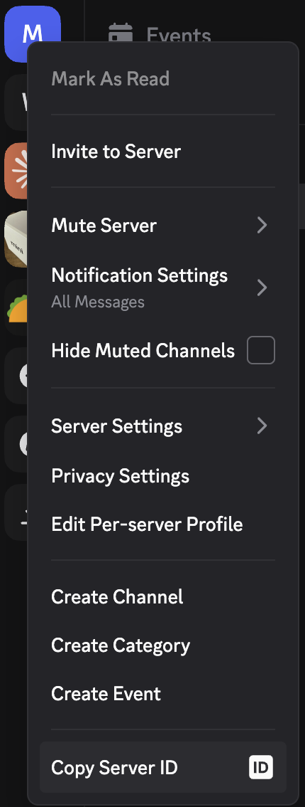
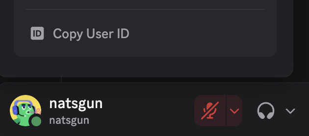

# Codex Discord Setup Guide

Complete setup guide for running `codex-discord` on macOS, Linux, or Windows.

> **[한국어 문서](docs/SETUP.kr.md)** | **[README](README.md)**

This guide covers:

- local Codex login
- Discord bot creation
- `.env` configuration
- background launchers for each OS
- first-run checks and common failure cases

## 1. Prerequisites

You need these on the machine that will run the bot:

- Node.js 20 or newer
- Codex CLI installed locally
- a completed `codex login`
- a Discord server where you can add a bot

Verify the basics:

```bash
node -v
codex --version
codex login status
```

If `codex login status` does not show a logged-in account, complete login first:

```bash
codex login
```

This project uses your local Codex login session. You do not need to paste an OpenAI API key into `.env`.

## 2. Install the Project

### Recommended: installer script

```bash
git clone git@github.com:chadingTV/codex-discord.git
cd codex-discord
./install.sh
```

Windows:

```bat
git clone git@github.com:chadingTV/codex-discord.git
cd codex-discord
install.bat
```

The install scripts:

- check Node.js
- install the Codex CLI if missing
- run `npm install`
- build the project
- start the platform launcher when possible

### Manual install

```bash
git clone git@github.com:chadingTV/codex-discord.git
cd codex-discord
npm install
npm run build
```

## 3. Create the Discord Bot

### 3.1 Create an application

1. Open <https://discord.com/developers/applications>
2. Click `New Application`
3. Give it a name like `My Codex Code`

### 3.2 Create a bot user

1. Open the `Bot` tab
2. Create the bot if Discord has not created one automatically
3. Copy the bot token

This becomes:

```env
DISCORD_BOT_TOKEN=...
```

### 3.3 Enable Message Content Intent

In the same `Bot` settings page:

- enable `MESSAGE CONTENT INTENT`
- save changes

Without this, the bot can register slash commands but will not respond to normal chat messages.

### 3.4 Invite the bot to your server

In `OAuth2 -> URL Generator`:

- Scopes:
  - `bot`
  - `applications.commands`
- Bot permissions:
  - `Send Messages`
  - `Embed Links`
  - `Read Message History`
  - `Use Slash Commands`
  - `Attach Files`

<p align="center">
  
</p>

<p align="center">
  
</p>

Open the generated URL in your browser and invite the bot to your target server.

## 4. Get Discord IDs

Enable Discord Developer Mode first:

- Discord `Settings -> Advanced -> Developer Mode`

Then collect:

- `DISCORD_GUILD_ID`
  - right-click the server name and copy server ID
- `ALLOWED_USER_IDS`
  - right-click your user and copy user ID
  - you can provide multiple IDs separated by commas

<p align="center">
  
</p>

<p align="center">
  
</p>

Example:

```env
DISCORD_GUILD_ID=123456789012345678
ALLOWED_USER_IDS=111111111111111111,222222222222222222
```

## 5. Configure `.env`

Create the file:

```bash
cp .env.example .env
```

Fill it in:

```env
DISCORD_BOT_TOKEN=your_bot_token
DISCORD_GUILD_ID=your_server_id
ALLOWED_USER_IDS=your_user_id
BASE_PROJECT_DIR=/Users/you/projects
RATE_LIMIT_PER_MINUTE=10
SHOW_COST=false
```

### Variable reference

| Variable | Meaning |
|---|---|
| `DISCORD_BOT_TOKEN` | Bot token from Discord Developer Portal |
| `DISCORD_GUILD_ID` | Discord server ID |
| `ALLOWED_USER_IDS` | Comma-separated list of users allowed to control the bot |
| `BASE_PROJECT_DIR` | Root directory the bot is allowed to register projects under |
| `RATE_LIMIT_PER_MINUTE` | Per-user Discord prompt limit |
| `SHOW_COST` | Controls the result footer; Codex login-based runs do not currently report real turn cost here |

### Choosing `BASE_PROJECT_DIR`

Pick a parent folder that contains the projects you want to control.

Examples:

- macOS: `/Users/you/work`
- Linux: `/home/you/projects`
- Windows: `C:\Users\you\projects`

When you later run `/register api-server`, the bot resolves it under that base directory.

Quick example:

- `BASE_PROJECT_DIR=/Users/you/projects`
- `/register api-server`
- resolved path: `/Users/you/projects/api-server`

## 6. Start the Bot

### macOS

```bash
./mac-start.sh
```

Useful commands:

```bash
./mac-start.sh --status
./mac-start.sh --stop
./mac-start.sh --fg
tail -f bot.log
```

Behavior:

- background bot via `launchd`
- native menu bar companion app
- foreground mode for debugging

First macOS run may require:

- Xcode Command Line Tools
- accepted Xcode license for compiling the Swift menu bar app

### Linux

```bash
./linux-start.sh
```

Useful commands:

```bash
./linux-start.sh --status
./linux-start.sh --stop
./linux-start.sh --fg
tail -f bot.log
```

Behavior:

- `systemd --user` service for the bot
- tray app if a desktop session is available
- tray menu can open a separate control panel with status, usage, and bot actions
- headless-friendly if no GUI is present

### Windows

```bat
win-start.bat
```

Useful commands:

```bat
win-start.bat --status
win-start.bat --stop
win-start.bat --fg
type bot.log
```

Behavior:

- background start script
- tray companion app when available
- foreground mode for debugging

## 7. First Discord Test

1. Open a channel in the server where the bot was invited.
2. Run:

```text
/register
```

3. Choose a folder under `BASE_PROJECT_DIR`.
4. Send a normal message like:

```text
analyze this project
```

5. Confirm the bot replies and, if needed, shows approval buttons.

Recommended follow-up checks:

- `/status`
- `/sessions`
- `/last`

## 8. How Session Discovery Works

`/sessions` does not only list sessions started by the Discord bot.

It also reads local Codex thread metadata from:

- `~/.codex/state_*.sqlite`
- rollout paths tracked in that state DB

Threads are filtered by project path (`cwd`), so if you used VS Code Codex in the same project folder, that thread can appear in Discord.

## 9. Attachments and Local Files

When a user uploads files:

- they are saved under `<project>/.codex-uploads/`
- image files are passed to Codex as local image paths
- other allowed files are passed as local file references
- blocked executable types are rejected
- the size limit is 25 MB per file

If you want to clean these up periodically, you should add your own housekeeping policy.

## 10. Operating Model

The safest workflow is:

- one Discord bot instance per machine
- one registered project per Discord channel
- one active Codex turn per channel at a time

While a turn is active:

- the bot shows a stop button
- additional prompts can be queued
- approval prompts can be accepted, denied, or auto-approved for the session

## 11. Troubleshooting

### Bot does not answer normal messages

Check:

- `MESSAGE CONTENT INTENT` is enabled in Discord Developer Portal
- your ID is listed in `ALLOWED_USER_IDS`
- the channel has been registered with `/register`
- the bot process is actually running

### Slash commands do not appear

Check:

- the bot was invited with `applications.commands`
- you are looking in the correct server
- the bot has started successfully

### `codex` works in terminal but bot fails

Check:

- `codex login status`
- the bot is running on the same machine and account that has the Codex login
- the background launcher can find `node`

Foreground mode is the fastest way to debug:

```bash
./mac-start.sh --fg
./linux-start.sh --fg
win-start.bat --fg
```

### `/sessions` shows nothing

Possible reasons:

- no prior Codex thread exists for that project path
- your VS Code Codex thread used a different working directory
- `~/.codex` has no readable state database yet

### The bot stopped responding after working once

Check:

- `bot.log`
- `bot-error.log`
- launcher status command for your platform

If needed, stop and start again.

## 12. Development Checks

```bash
npm run build
npm test
```

Type-check only:

```bash
./node_modules/.bin/tsc --noEmit
```

## 13. Notes for Real-World Use

- Avoid controlling the exact same thread from Discord and VS Code at the same moment.
- Keep your bot token private.
- Restrict `ALLOWED_USER_IDS` aggressively.
- Use a narrow `BASE_PROJECT_DIR`, not your home directory root.
