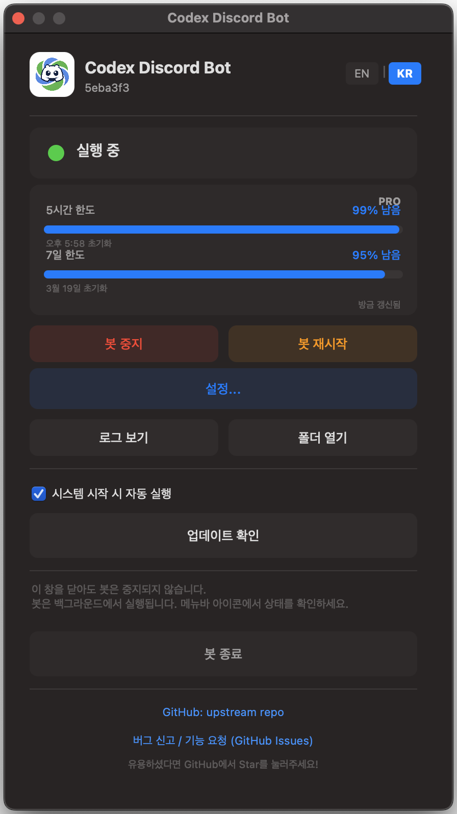

<p align="center">
  
</p>

# Codex Discord Controller

Discord에서 로컬 Codex 작업을 제어하는 self-hosted 봇입니다.
내 컴퓨터에서 Codex를 실행한 상태로, Discord 채널 하나를 프로젝트 폴더 하나에 연결하고, 휴대폰이나 데스크톱, VS Code에서 같은 로컬 스레드를 이어서 사용할 수 있습니다.

**API 키를 직접 붙여넣을 필요는 없습니다.** 이 프로젝트는 로컬 `codex login` 세션을 사용합니다.

> **[English README](../README.md)** | **[설치 가이드](SETUP.kr.md)**

## 이 프로젝트가 하는 일

`codex-discord`는 로컬 프로젝트와 Codex CLI 로그인 세션이 있는 같은 머신에서 동작하는 Discord 봇입니다.

Discord를 Codex 제어 UI로 사용합니다.

- Discord 채널을 로컬 프로젝트 폴더에 연결
- 일반 메시지로 Codex 스레드 시작 또는 이어쓰기
- 해당 프로젝트의 기존 로컬 Codex 스레드 재개
- 파일 수정이나 명령 실행 승인 버튼 제공
- 진행 중 중지, 큐 확인, 마지막 응답 조회 지원

`~/.codex` 아래의 로컬 스레드 저장소를 읽기 때문에, 같은 프로젝트 경로에서 사용한 VS Code Codex 스레드도 `/sessions`에서 보일 수 있습니다.

## 왜 Discord로 Codex를 쓰나

- 휴대폰에 이미 설치되어 있음
- 승인 요청이나 작업 완료를 푸시 알림으로 받기 쉬움
- 채널 단위로 프로젝트를 나누기 좋음
- 버튼, 셀렉트 메뉴, 임베드만으로도 제어 UI가 충분함
- 여러 머신을 한 서버에 붙여 운영하기 쉬움

## 주요 기능

- `codex login`으로 로그인한 로컬 Codex 계정 사용
- Discord 채널 1개 = 로컬 프로젝트 디렉터리 1개
- `~/.codex` 상태 저장소 기반 기존 Codex 스레드 재개
- 봇이 만든 스레드뿐 아니라 같은 프로젝트 경로의 VS Code Codex 스레드도 재개 가능
- Discord 승인 UI로 tool call / 파일 변경 승인 처리
- Codex의 사용자 입력 질문을 Discord UI로 전달
- 버튼 또는 `/stop`으로 실행 중 turn 중단
- 작업 중 추가 프롬프트 큐잉
- 이미지/파일 첨부 지원
- `/usage`로 Discord 안에서 Codex 사용량 확인
- SQLite 기반 프로젝트/세션 매핑
- 허용 사용자 화이트리스트, rate limit, 경로 검증
- macOS / Linux / Windows용 백그라운드 실행 스크립트 제공

## 동작 구조

```text
[Discord]
    |
    v
[discord.js bot]
    |
    v
[Codex session manager]
    |
    +--> Codex app-server protocol
    +--> ~/.codex state_*.sqlite
    +--> rollout JSONL logs
```

- 채널과 프로젝트 경로 매핑은 로컬 SQLite에 저장됩니다.
- 메시지가 오면 해당 프로젝트에 대해 Codex 스레드를 시작하거나 재개합니다.
- `/sessions`는 로컬 Codex 스레드 메타데이터를 읽어서 기존 스레드를 다시 붙게 해줍니다.
- 응답은 Discord에 스트리밍되며, 긴 메시지와 코드블록도 분할해서 보냅니다.

## 요구 사항

- Node.js 20+
- Codex CLI 설치: `@openai/codex`
- 로컬 `codex login` 완료
- Discord bot token
- Discord server ID, 허용 사용자 ID 목록

## 설치

```bash
git clone https://github.com/chadingTV/codex-discord.git
cd codex-discord

# macOS / Linux
./install.sh

# Windows
install.bat
```

## 설치 가이드

| 언어 | 문서 |
|---|---|
| English | [../SETUP.md](../SETUP.md) |
| 한국어 | [SETUP.kr.md](SETUP.kr.md) |

수동 설치가 필요하거나 Discord bot 생성 절차까지 한 번에 보고 싶으면 설치 가이드를 보면 됩니다.

## 빠른 시작

1. 봇을 돌릴 머신에서 먼저 Codex 로그인 상태를 준비합니다.

```bash
codex login
codex login status
```

2. `.env.example`에서 `.env`를 만듭니다.

```bash
cp .env.example .env
```

3. 값을 채웁니다.

```env
DISCORD_BOT_TOKEN=...
DISCORD_GUILD_ID=...
ALLOWED_USER_IDS=123456789012345678
BASE_PROJECT_DIR=/Users/you/projects
RATE_LIMIT_PER_MINUTE=10
SHOW_COST=false
```

일반적인 사용에서는 `.env`에 `OPENAI_API_KEY`를 넣지 않습니다. 이 프로젝트는 로컬 `codex login` 세션을 그대로 사용합니다.

4. 봇을 시작합니다.

```bash
# macOS
./mac-start.sh

# Linux
./linux-start.sh

# Windows
win-start.bat
```

## 시작 전 체크리스트

실사용 전에 아래를 모두 끝내면 됩니다.

1. 봇을 돌릴 머신에서 `codex login` 완료
2. Discord 애플리케이션과 bot 생성
3. `MESSAGE CONTENT INTENT` 활성화
4. `bot`, `applications.commands` scope로 bot 초대
5. 서버 ID와 허용 사용자 ID 복사
6. `.env` 작성
7. 플랫폼 실행 스크립트로 시작

이미지 포함 전체 절차는 [SETUP.kr.md](SETUP.kr.md)에 정리돼 있습니다.

## 패널 미리보기

Discord 안에서 보이는 제어 패널과 세션 흐름은 이런 느낌입니다:

<p align="center">
  
</p>

설치 스크린샷과 전체 설정 절차는 [SETUP.kr.md](SETUP.kr.md)를 보면 됩니다.

## 명령어

| 명령어 | 설명 |
|---|---|
| `/register <path>` | 현재 채널을 프로젝트 디렉터리에 연결 |
| `/unregister` | 채널-프로젝트 연결 해제 |
| `/status` | 서버 내 등록된 프로젝트 상태 확인 |
| `/stop` | 현재 채널의 Codex turn 중단 |
| `/auto-approve on\|off` | 현재 채널 승인 우회 여부 설정 |
| `/sessions` | 프로젝트의 기존 로컬 Codex 세션 목록 및 재개 |
| `/last` | 현재 세션의 마지막 assistant 응답 조회 |
| `/usage` | 로컬 계정 기준 Codex 사용량 확인 |
| `/queue list` | 현재 채널 큐 확인 |
| `/queue clear` | 큐 비우기 |
| `/clear-sessions` | 현재 프로젝트의 저장된 세션 매핑 제거 |

## 일반적인 사용 흐름

1. Discord 채널에서 `/register` 실행
2. `BASE_PROJECT_DIR` 아래 프로젝트 폴더 선택 또는 입력
3. `fix the failing tests` 같은 일반 메시지 전송
4. Codex가 명령 실행이나 파일 수정을 원하면 Discord에서 승인 또는 거부
5. 필요할 때 `/sessions`, `/last`, `/usage`로 현재 상태를 다시 확인하기

## 프로젝트 경로 정책

이 봇은 base directory 경계를 강제합니다.

- `BASE_PROJECT_DIR`가 사용 가능한 프로젝트 루트입니다
- `/register my-app`은 `BASE_PROJECT_DIR/my-app`으로 해석됩니다
- `/register apps/api-server` 같은 중첩 경로도 autocomplete로 선택할 수 있습니다
- 절대 경로도 허용되지만 최종 경로가 `BASE_PROJECT_DIR` 내부여야 합니다
- 폴더가 아직 없으면 `/register`가 새로 만들 수 있습니다

즉 Discord에서는 간단하게 쓰되, 허용된 프로젝트 루트 밖으로 나가는 경로는 막는 구조입니다.

## 첨부파일

Discord에 파일을 첨부하면:

- `<project>/.codex-uploads/` 아래로 다운로드
- 이미지는 로컬 이미지 경로로 프롬프트에 추가
- 일반 파일도 로컬 파일 경로로 프롬프트에 추가
- 실행 파일 계열은 차단
- 25MB 초과 파일은 건너뜀

## Codex 세션 동작 방식

이 프로젝트는 Codex의 로컬 저장 구조를 기준으로 동작합니다.

- 로컬 스레드 메타데이터는 `~/.codex/state_*.sqlite`에서 읽음
- rollout 로그는 해당 state DB가 가리키는 JSONL 파일에서 읽음
- `/sessions`는 프로젝트 `cwd` 기준으로 스레드를 필터링함

그래서 같은 프로젝트 경로에서 VS Code Codex를 사용한 적이 있다면, 그 스레드가 Discord에도 나타날 수 있습니다.

운영 팁:

- Discord와 VS Code 사이를 번갈아 이어쓰는 건 괜찮습니다
- 같은 스레드를 두 클라이언트에서 동시에 강하게 조작하는 건 권장하지 않습니다

## 보안 메모

- 이 프로젝트는 HTTP 서버를 열지 않습니다
- 접근은 `ALLOWED_USER_IDS`로 제한됩니다
- 사용자별 rate limit이 적용됩니다
- 프로젝트 등록은 `BASE_PROJECT_DIR` 안으로 제한됩니다
- 실행 파일 첨부는 차단됩니다
- Discord bot token은 `.env`에 있으므로 외부에 노출하면 안 됩니다

## 플랫폼 실행기

### macOS

- `./mac-start.sh`: 백그라운드 bot + 메뉴바 앱 시작
- `./mac-start.sh --fg`: 디버깅용 foreground 실행
- `./mac-start.sh --stop`: bot 중지
- `./mac-start.sh --status`: 상태 확인

### Linux

- `./linux-start.sh`: `systemd --user` 기반 실행
- 데스크톱 세션이 있으면 tray 앱도 시작
- tray 메뉴에서 상태, 사용량, 봇 제어가 보이는 별도 컨트롤 패널을 열 수 있음
- `./linux-start.sh --fg`: foreground 디버깅 실행

### Windows

- `win-start.bat`: bot + tray 앱 시작
- `win-start.bat --fg`: foreground 실행
- `win-start.bat --stop`: bot 중지

## 개발

```bash
npm install
npm run build
npm test
npm run dev
```

## 프로젝트 구조

```text
codex-discord/
├── src/
│   ├── bot/        # Discord client, commands, handlers
│   ├── codex/      # Codex app-server client and session manager
│   ├── db/         # SQLite project/session mapping
│   ├── security/   # whitelist, rate limit, path validation
│   └── utils/      # config and i18n helpers
├── menubar/        # macOS menu bar app
├── tray/           # Linux/Windows tray apps
├── install.sh
├── install.bat
├── mac-start.sh
├── linux-start.sh
├── win-start.bat
└── SETUP.md
```

## 제한 사항

- Discord에 보이는 봇 이름은 이 저장소가 아니라 Discord Developer Portal 설정에 따릅니다
- 결과 footer의 비용 표시는 토글만 있고, 현재 Codex 로그인 기반 실행에서 실제 turn 비용을 여기서 계산하진 않습니다
- 같은 스레드를 여러 클라이언트에서 동시에 강하게 사용하면 흐름이 꼬일 수 있습니다

## 라이선스

MIT. 자세한 내용은 [LICENSE](../LICENSE)를 참고하세요.
