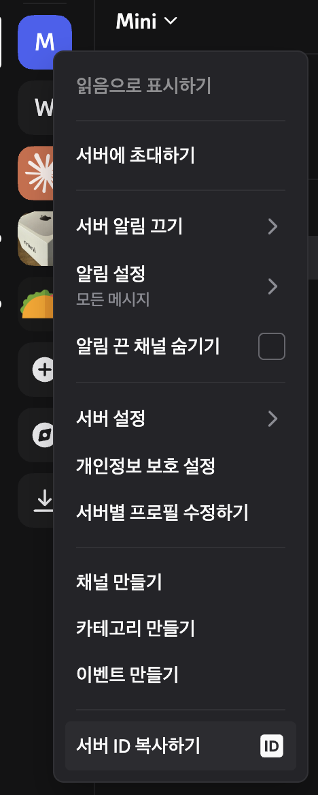
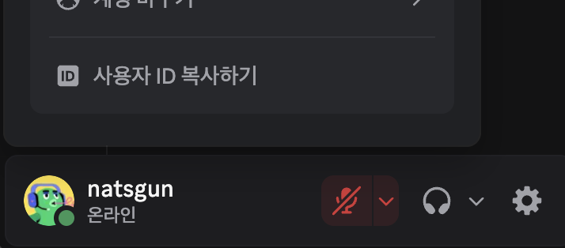

# Codex Discord 설치 가이드

`codex-discord`를 macOS, Linux, Windows에서 실행하기 위한 전체 설치 문서입니다.

이 문서는 다음 내용을 다룹니다.

- 로컬 Codex 로그인
- Discord bot 생성
- `.env` 설정
- OS별 백그라운드 실행
- 첫 실행 점검과 자주 막히는 문제

> **[English Setup](../SETUP.md)** | **[한국어 README](README.kr.md)**

## 1. 사전 준비

봇을 돌릴 머신에 아래가 필요합니다.

- Node.js 20 이상
- 로컬에 설치된 Codex CLI
- 완료된 `codex login`
- 봇을 초대할 Discord 서버

먼저 기본 상태를 확인합니다.

```bash
node -v
codex --version
codex login status
```

`codex login status`에서 로그인된 계정이 보이지 않으면 먼저 로그인부터 해야 합니다.

```bash
codex login
```

이 프로젝트는 로컬 Codex 로그인 세션을 사용합니다. OpenAI API 키를 `.env`에 직접 넣을 필요는 없습니다.
예전에 다른 프로젝트에서 API 키 기반 흐름을 썼더라도, 여기서는 특별히 `codex login --with-api-key`를 의도하지 않는 한 그 방식이 필요하지 않습니다.

## 2. 프로젝트 설치

### 권장: 설치 스크립트 사용

```bash
git clone https://github.com/chadingTV/codex-discord.git
cd codex-discord
./install.sh
```

Windows:

```bat
git clone https://github.com/chadingTV/codex-discord.git
cd codex-discord
install.bat
```

설치 스크립트가 하는 일:

- Node.js 확인
- Codex CLI가 없으면 설치
- `npm install`
- 프로젝트 빌드
- 가능하면 플랫폼 실행 스크립트 시작

### 수동 설치

```bash
git clone https://github.com/chadingTV/codex-discord.git
cd codex-discord
npm install
npm run build
```

## 3. Discord Bot 만들기

### 3.1 애플리케이션 생성

1. <https://discord.com/developers/applications> 접속
2. `New Application` 클릭
3. 예: `My Codex Code` 같은 이름 입력

### 3.2 Bot 사용자 생성

1. `Bot` 탭으로 이동
2. 필요하면 bot 생성
3. bot token 복사

이 값이:

```env
DISCORD_BOT_TOKEN=...
```

입니다.

### 3.3 Message Content Intent 켜기

같은 `Bot` 설정 페이지에서:

- `MESSAGE CONTENT INTENT` 활성화
- 저장

이걸 켜지 않으면 slash command는 등록되어도 일반 채팅 메시지에 답하지 못합니다.

### 3.4 서버에 Bot 초대

`OAuth2 -> URL Generator`에서:

- Scopes:
  - `bot`
  - `applications.commands`
<p align="center">
  
</p>

- Bot permissions:
  - `Send Messages`
  - `Embed Links`
  - `Read Message History`
  - `Use Slash Commands`
  - `Attach Files`


<p align="center">
  
</p>

생성된 URL을 열어서 원하는 Discord 서버에 bot을 초대합니다.

## 4. Discord ID 가져오기

먼저 Discord 개발자 모드를 켭니다.

- Discord `설정 -> 고급 -> Developer Mode`

그 다음 아래 값을 복사합니다.

- `DISCORD_GUILD_ID`
  - 서버 이름 우클릭 -> 서버 ID 복사
<p align="center">
  
</p>


- `ALLOWED_USER_IDS`
  - 사용자 우클릭 -> 사용자 ID 복사
  - 여러 명이면 쉼표로 구분 가능

<p align="center">
  
</p>

예시:

```env
DISCORD_GUILD_ID=123456789012345678
ALLOWED_USER_IDS=111111111111111111,222222222222222222
```

## 5. `.env` 설정

파일 생성:

```bash
cp .env.example .env
```

내용 작성:

```env
DISCORD_BOT_TOKEN=your_bot_token
DISCORD_GUILD_ID=your_server_id
ALLOWED_USER_IDS=your_user_id
BASE_PROJECT_DIR=/Users/you/projects
RATE_LIMIT_PER_MINUTE=10
SHOW_COST=false
```

### 변수 설명

| 변수 | 의미 |
|---|---|
| `DISCORD_BOT_TOKEN` | Discord Developer Portal에서 발급받은 bot token |
| `DISCORD_GUILD_ID` | Discord 서버 ID |
| `ALLOWED_USER_IDS` | 봇을 제어할 수 있는 사용자 ID 목록 |
| `BASE_PROJECT_DIR` | 등록 가능한 프로젝트 루트 경로 |
| `RATE_LIMIT_PER_MINUTE` | 사용자별 분당 요청 제한 |
| `SHOW_COST` | 결과 footer 제어용 옵션. 현재 Codex 로그인 기반 실행에서 실제 비용을 계산하진 않음 |

이 프로젝트의 일반적인 설정에는 `OPENAI_API_KEY` 변수가 필요하지 않습니다.

### `BASE_PROJECT_DIR` 고르기

원격 제어할 프로젝트들이 들어 있는 상위 폴더를 지정하면 됩니다.

예시:

- macOS: `/Users/you/work`
- Linux: `/home/you/projects`
- Windows: `C:\Users\you\projects`

이후 `/register api-server`를 입력하면 이 base directory 아래로 해석됩니다.
`/register apps/api-server` 같은 중첩 경로도 autocomplete로 선택할 수 있습니다.

간단한 예:

- `BASE_PROJECT_DIR=/Users/you/projects`
- `/register api-server`
- 최종 경로: `/Users/you/projects/api-server`

## 6. 봇 시작

### macOS

```bash
./mac-start.sh
```

유용한 명령:

```bash
./mac-start.sh --status
./mac-start.sh --stop
./mac-start.sh --fg
tail -f bot.log
```

동작 방식:

- `launchd` 기반 백그라운드 bot
- 네이티브 메뉴바 앱
- 디버깅용 foreground 모드

macOS 첫 실행에서는 아래가 필요할 수 있습니다.

- Xcode Command Line Tools
- Swift 메뉴바 앱 컴파일을 위한 Xcode license 승인

### Linux

```bash
./linux-start.sh
```

유용한 명령:

```bash
./linux-start.sh --status
./linux-start.sh --stop
./linux-start.sh --fg
tail -f bot.log
```

동작 방식:

- `systemd --user` 서비스
- 데스크톱 세션이 있으면 tray 앱 시작
- tray 메뉴에서 상태, 사용량, 봇 제어용 별도 컨트롤 패널 열기 가능
- GUI가 없어도 headless 모드로 실행 가능

### Windows

```bat
win-start.bat
```

유용한 명령:

```bat
win-start.bat --status
win-start.bat --stop
win-start.bat --fg
type bot.log
```

동작 방식:

- 백그라운드 시작 스크립트
- 가능하면 tray 앱 실행
- 디버깅용 foreground 모드 제공

## 7. 첫 Discord 테스트

1. bot을 초대한 서버의 채널을 엽니다.
2. 아래 명령을 실행합니다.

```text
/register
```

3. `BASE_PROJECT_DIR` 아래 폴더를 선택합니다.
   `apps/api-server` 같은 중첩 경로도 선택할 수 있습니다.
4. 일반 메시지로 예를 들어:

```text
analyze this project
```

5. 응답이 오는지, 필요하면 승인 버튼이 뜨는지 확인합니다.

추가 확인용 명령:

- `/status`
- `/sessions`
- `/last`
- `/usage`

## 8. 세션 목록은 어떻게 보나

`/sessions`는 Discord bot이 만든 세션만 보여주는 게 아닙니다.

아래 로컬 Codex 저장소도 읽습니다.

- `~/.codex/state_*.sqlite`
- 그 state DB가 가리키는 rollout 로그 경로

프로젝트 경로(`cwd`) 기준으로 필터링하기 때문에, 같은 프로젝트 폴더에서 VS Code Codex를 썼다면 그 스레드도 Discord에 나타날 수 있습니다.

## 9. 첨부파일과 로컬 파일 처리

사용자가 파일을 올리면:

- `<project>/.codex-uploads/` 아래에 저장
- 이미지 파일은 로컬 이미지 경로로 Codex에 전달
- 일반 파일도 로컬 파일 참조로 전달
- 실행 파일 계열은 차단
- 파일당 25MB 제한

업로드 파일 정리는 자동 정책이 없으므로, 운영 중이면 별도 정리 정책을 두는 편이 좋습니다.

## 10. 운영 모델

가장 안전한 운영 방식은 이렇습니다.

- 머신당 Discord bot 인스턴스 1개
- Discord 채널당 등록 프로젝트 1개
- 채널당 한 번에 활성 Codex turn 1개

turn 실행 중에는:

- stop 버튼이 보이고
- 추가 프롬프트를 큐에 넣을 수 있고
- 승인 요청을 수락, 거부, 세션 단위 자동 승인으로 처리할 수 있습니다

## 11. 트러블슈팅

### 일반 메시지에 답하지 않음

확인할 것:

- Discord Developer Portal에서 `MESSAGE CONTENT INTENT`를 켰는지
- 내 ID가 `ALLOWED_USER_IDS`에 들어 있는지
- 해당 채널이 `/register` 되어 있는지
- 실제 bot 프로세스가 살아 있는지

### Slash command가 보이지 않음

확인할 것:

- bot 초대 시 `applications.commands` scope가 포함됐는지
- 올바른 서버에서 보고 있는지
- bot이 정상 시작됐는지

### 터미널에서는 `codex`가 되는데 bot은 실패함

확인할 것:

- `codex login status`
- bot이 같은 머신과 같은 계정 환경에서 돌고 있는지
- background launcher가 `node`를 제대로 찾는지
- `.env` API 키 방식으로 동작할 거라고 기대하고 있지 않은지

빠르게 확인하려면 foreground 모드가 제일 낫습니다.

```bash
./mac-start.sh --fg
./linux-start.sh --fg
win-start.bat --fg
```

### `/sessions`에 아무것도 안 보임

가능한 원인:

- 해당 프로젝트 경로에 이전 Codex 스레드가 없음
- VS Code Codex에서 다른 working directory를 썼음
- `~/.codex`에 읽을 수 있는 state DB가 아직 없음

### 한 번 되다가 나중에 응답이 멈춤

확인할 것:

- `bot.log`
- `bot-error.log`
- 플랫폼별 status 명령 결과

필요하면 stop 후 다시 start하면 됩니다.

## 12. 개발 점검

```bash
npm run build
npm test
```

타입 체크만 할 때:

```bash
./node_modules/.bin/tsc --noEmit
```

## 13. 실사용 메모

- 같은 스레드를 Discord와 VS Code에서 동시에 강하게 조작하는 건 피하는 편이 좋습니다.
- bot token은 외부에 노출하면 안 됩니다.
- `ALLOWED_USER_IDS`는 가능한 좁게 유지하세요.
- `BASE_PROJECT_DIR`는 홈 디렉터리 전체보다, 실제 프로젝트 폴더 상위만 잡는 편이 안전합니다.
